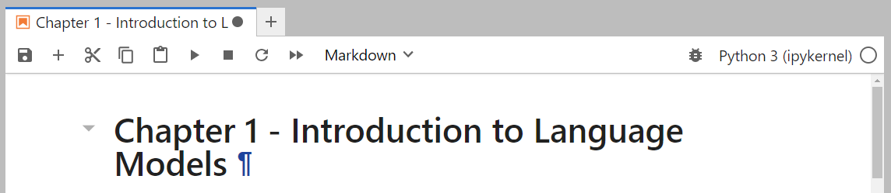

<!-- TODO: Finish up specific instructions with https://medium.com/@mohammdowais/how-to-record-terminal-in-a-windows-computer-c140feb9a6e3 -->

# Local Environment with Conda

我们推荐在本地运行代码时使用通过Conda管理的受控环境。 

## 1. 安装Miniconda

要设置一个包含Python和所有必要依赖项的Conda环境，我们建议使用一个最小化版本的conda，也就是miniconda [miniconda](https://docs.anaconda.com/free/miniconda/miniconda-other-installer-links/). 

根据您的操作系统，我们选择已预装 Python 3.10 的环境。以下以 Windows 为例说明安装流程：


下面是linux下的安装说明:


## 2. 配置Conda环境

安装完成后，请打开终端，按以下步骤创建您的 Conda 环境：

```bash
conda create -n thellmbook python=3.10
```

在使用 Conda 之前，我们需要先激活环境：

```bash
conda activate thellmbook
```

## 2. 安装Dependencies

创建环境后，需要安装所有依赖项。如果您是通过 `environment.yml` 文件创建环境，可以跳过此步骤。

以下是安装依赖项的两种方法：
1. 通过 requirements.txt 安装全部依赖（需先安装 Microsoft Visual C++ 14.0）
2. 通过 requirements_base.txt 安装基础依赖

第一种方法，在本仓库的根目录下通过 `requirements.txt` 直接安装所有依赖项（不包括第11章的依赖项），运行以下命令：

```bash
pip install -r requirements.txt
```

这会在我们刚刚创建的环境中安装所有必要的依赖项。 

> [!TIP]
> 如果执行 pip install -r requirements.txt 时出现错误，请运行以下命令来解决该问题。
> ```python
> pip install --upgrade pip
> ```

> [!TIP]
> `requirements.txt` 文件通过固定依赖版本确保环境可重复复现。不过，这样做可能会导致您错过许多包的最新功能特性。您可以改用 `requirements_min.txt`，它会安装所有包的最新版本。需要注意的是，这样做可能会导致某些示例无法正常工作，因为这些包的 API 可能会随时间推移而发生变化。

> [!WARNING]
> If you get the following error `error: Microsoft Visual C++ 14.0 or greater is required.` then you will need to install C++. 
> Follow the instructions [here](common_issues.md) for an installation guide before you can install your environment.

### [OPTIONAL] Installing dependencies with conda
If you run into issues with the `requirements.txt` file, you can also install a base set of dependencies that are installed throughout the book:

```bash
pip install -r requirements_base.txt
```

缺失的依赖项可以通过按照每个章节文件夹中的 README 说明进行安装。或者，您可以一次性安装所有依赖项：

```bash
# Install BERTopic and annoy through conda to prevent additional C++ installations
# conda config --add channels conda-forge
conda config --append channels conda-forge
conda install bertopic=0.16.0 python-annoy=1.17.2
```

这样做可以为您提供更大的灵活性，可以选择所需的依赖包版本，而无需受限于某些可能失去支持的版本。

## 3. 安装 PyTorch

现在您已安装所有必要依赖项，可能需要更新某个特定依赖项，例如 PyTorch。由于您的操作系统环境不同，PyTorch 可能默认安装了 CPU 版本，而大部分示例需要使用 GPU 进行加速 。

If you go to the official [PyTorch website](https://pytorch.org/), then you'll find on the frontpage the current guideline for installing the package:


您可以根据自身需求选择所需的 CUDA 版本（通常建议选择默认选项）。复制对应的 pip 安装命令行，并在终端中运行它们：


```bash
pip3 install --upgrade torch torchvision torchaudio --index-url https://download.pytorch.org/whl/cu118
```

请注意，我们在此添加了 `--upgrade` 标签，以确保用 GPU 版本覆盖原有的 CPU 版本 PyTorch。

## 4. Starting Jupyter Lab

After having installed all necessary packages, you can then use Jupyter Lab (or any other notebook backend) to run all of the notebooks associated with each chapter. You can start Jupyter Lab directly from the terminal:

```bash
jupyter lab
```

安装所有必要软件包后，您可以使用 Jupyter Lab（或其他 Notebook软件）运行与各章节相关的所有笔记本文件。您可以通过终端直接启动 Jupyter Lab：





随后，您会看到一个窗口，可以从列表中选择名为 "thellmbook" 的环境：


要验证操作是否成功，您可以检查所选环境是否能够访问 GPU:


```python
import torch

torch.cuda.is_available()
```

或通过检查当前 conda 环境来验证：

```python
import sys
import os

# Get the path to the current conda environment
python_path = sys.executable
env_path = os.path.dirname(os.path.dirname(python_path))
env_name = os.environ.get('CONDA_DEFAULT_ENV')
env_name
```
