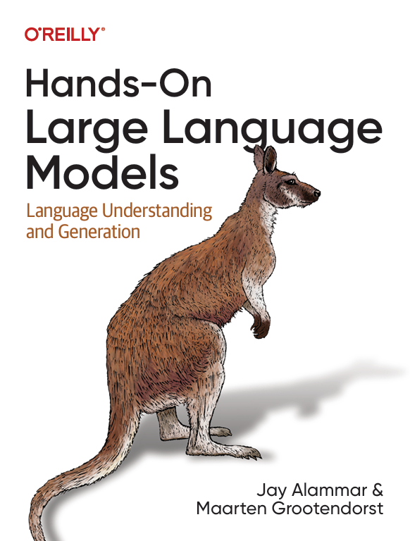
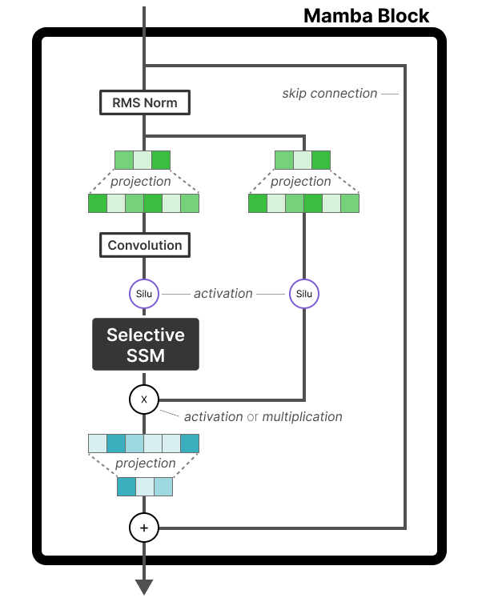
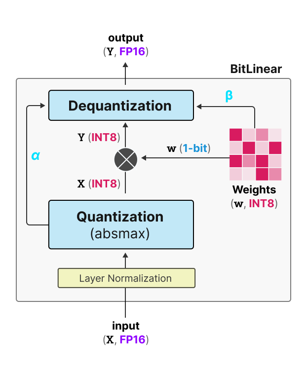
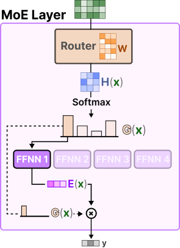

# Hands-On Large Language Models

<a href="https://www.linkedin.com/in/jalammar/"></a>
<a href="https://www.linkedin.com/in/mgrootendorst/"></a>

Welcome! In this repository you will find the code for all examples throughout the book [Hands-On Large Language Models](https://www.amazon.com/Hands-Large-Language-Models-Understanding/dp/1098150961) written by [Jay Alammar](https://www.linkedin.com/in/jalammar/) and [Maarten Grootendorst](https://www.linkedin.com/in/mgrootendorst/) which we playfully dubbed: <br> 

<p align="center"><b><i>"The Illustrated LLM Book"</i></b></p>

Through the visually educational nature of this book and with **almost 300 custom made figures**, learn the practical tools and concepts you need to use Large Language Models today!

<a href="https://www.amazon.com/Hands-Large-Language-Models-Understanding/dp/1098150961"></a>

<br>

The book is available on:

* [Amazon](https://www.amazon.com/Hands-Large-Language-Models-Understanding/dp/1098150961)
* [Shroff Publishers (India)](https://www.shroffpublishers.com/books/computer-science/large-language-models/9789355425522/)
* [O'Reilly](https://www.oreilly.com/library/view/hands-on-large-language/9781098150952/)
* [Kindle](https://www.amazon.com/Hands-Large-Language-Models-Alammar-ebook/dp/B0DGZ46G88/ref=tmm_kin_swatch_0?_encoding=UTF8&qid=&sr=)
* [Barnes and Noble](https://www.barnesandnoble.com/w/hands-on-large-language-models-jay-alammar/1145185960)
* [Goodreads](https://www.goodreads.com/book/show/210408850-hands-on-large-language-models)

## Table of Contents

We advise to run all examples through Google Colab for the easiest setup. Google Colab allows you to use a T4 GPU with 16GB of VRAM for free. All examples were mainly built and tested using Google Colab, so it should be the most stable platform. However, any other cloud provider should work. 

| Chapter  | Notebook  |
|---|---|
| Chapter 1: Introduction to Language Models  | [](https://colab.research.google.com/github/HandsOnLLM/Hands-On-Large-Language-Models/blob/main/chapter01/Chapter%201%20-%20Introduction%20to%20Language%20Models.ipynb)   |
| Chapter 2: Tokens and Embeddings  | [](https://colab.research.google.com/github/HandsOnLLM/Hands-On-Large-Language-Models/blob/main/chapter02/Chapter%202%20-%20Tokens%20and%20Token%20Embeddings.ipynb)  |
| Chapter 3: Looking Inside Transformer LLMs  | [](https://colab.research.google.com/github/HandsOnLLM/Hands-On-Large-Language-Models/blob/main/chapter03/Chapter%203%20-%20Looking%20Inside%20LLMs.ipynb)  |
| Chapter 4: Text Classification  | [](https://colab.research.google.com/github/HandsOnLLM/Hands-On-Large-Language-Models/blob/main/chapter04/Chapter%204%20-%20Text%20Classification.ipynb)  |
| Chapter 5: Text Clustering and Topic Modeling  | [](https://colab.research.google.com/github/HandsOnLLM/Hands-On-Large-Language-Models/blob/main/chapter05/Chapter%205%20-%20Text%20Clustering%20and%20Topic%20Modeling.ipynb)  |
| Chapter 6: Prompt Engineering  | [](https://colab.research.google.com/github/HandsOnLLM/Hands-On-Large-Language-Models/blob/main/chapter06/Chapter%206%20-%20Prompt%20Engineering.ipynb)  |
| Chapter 7: Advanced Text Generation Techniques and Tools  | [](https://colab.research.google.com/github/HandsOnLLM/Hands-On-Large-Language-Models/blob/main/chapter07/Chapter%207%20-%20Advanced%20Text%20Generation%20Techniques%20and%20Tools.ipynb)  |
| Chapter 8: Semantic Search and Retrieval-Augmented Generation  | [](https://colab.research.google.com/github/HandsOnLLM/Hands-On-Large-Language-Models/blob/main/chapter08/Chapter%208%20-%20Semantic%20Search.ipynb)  |
| Chapter 9: Multimodal Large Language Models  | [](https://colab.research.google.com/github/HandsOnLLM/Hands-On-Large-Language-Models/blob/main/chapter09/Chapter%209%20-%20Multimodal%20Large%20Language%20Models.ipynb)  |
| Chapter 10: Creating Text Embedding Models  | [](https://colab.research.google.com/github/HandsOnLLM/Hands-On-Large-Language-Models/blob/main/chapter10/Chapter%2010%20-%20Creating%20Text%20Embedding%20Models.ipynb)  |
| Chapter 11: Fine-tuning Representation Models for Classification  | [](https://colab.research.google.com/github/HandsOnLLM/Hands-On-Large-Language-Models/blob/main/chapter11/Chapter%2011%20-%20Fine-Tuning%20BERT.ipynb)  |
| Chapter 12: Fine-tuning Generation Models  | [](https://colab.research.google.com/github/HandsOnLLM/Hands-On-Large-Language-Models/blob/main/chapter12/Chapter%2012%20-%20Fine-tuning%20Generation%20Models.ipynb)  |

> [!TIP]
> You can check the [setup](.setup/) folder for a quick-start guide to install all packages locally and you can check the [conda](.setup/conda/) folder for a complete guide on how to setup your environment, including conda and PyTorch installation.
> Note that the depending on your OS, Python version, and dependencies your results might be slightly differ. However, they
> should this be similar to the examples in the book. 


## Reviews

> "*Jay and Maarten have continued their tradition of providing beautifully illustrated and insightful descriptions of complex topics in their new book. Bolstered with working code, timelines, and references to key papers, their book is a valuable resource for anyone looking to understand the main techniques behind how Large Language Models are built.*"
>    
> **Andrew Ng** - founder of [DeepLearning.AI](https://www.deeplearning.ai/)

---

> "*This is an exceptional guide to the world of language models and their practical applications in industry. Its highly-visual coverage of generative, representational, and retrieval applications of language models empowers readers to quickly understand, use, and refine LLMs. Highly recommended!*"
>
> **Nils Reimers** - Director of Machine Learning at Cohere | creator of [sentence-transformers](https://github.com/UKPLab/sentence-transformers)

---

> "*I can’t think of another book that is more important to read right now. On every single page, I learned something that is critical to success in this era of language models.*"
> 
> **Josh Starmer** - [StatQuest](https://www.youtube.com/channel/UCtYLUTtgS3k1Fg4y5tAhLbw)

---

> "*If you’re looking to get up to speed in everything regarding LLMs, look no further! In this wonderful book, Jay and Maarten will take you from zero to expert in the history and latest advances in large language models. With very intuitive explanations, great real-life examples, clear illustrations, and comprehensive code labs, this book lifts the curtain on the complexities of transformer models, tokenizers, semantic search, RAG, and many other cutting-edge technologies. A must read for anyone interested in the latest AI technology!*"
> 
> **Luis Serrano, PhD** - Founder and CEO of [Serrano Academy](https://www.youtube.com/@SerranoAcademy)

---

> "*Hands-On Large Language Models brings clarity and practical examples to cut through the hype of AI. It provides a wealth of great diagrams and visual aids to supplement the clear explanations. The worked examples and code make concrete what other books leave abstract. The book starts with simple introductory beginnings, and steadily builds in scope. By the final chapters, you will be fine-tuning and building your own large language models with confidence.*"
>
> **Leland McInnes** - Researcher at the Tutte Institute for Mathematics and Computing | creator of [UMAP](https://github.com/lmcinnes/umap) and [HDBSCAN](https://github.com/scikit-learn-contrib/hdbscan)

---

## Additional Resources

We attempted to put as much information into the book without it being overwhelming. However, even with a 400-page book there is still much to discover! 

We continue to create more guides that compliment the book and go more in-depth into new and exciting topics:

| [A Visual Guide to Mamba](https://newsletter.maartengrootendorst.com/p/a-visual-guide-to-mamba-and-state)             |  [A Visual Guide to Quantization](https://newsletter.maartengrootendorst.com/p/a-visual-guide-to-quantization) | [The Illustrated Stable Diffusion](https://jalammar.github.io/illustrated-stable-diffusion/) |
:-------------------------:|:-------------------------:|:-------------------------:
  |   |  
**[A Visual Guide to Mixture of Experts](https://newsletter.maartengrootendorst.com/p/a-visual-guide-to-mixture-of-experts)**  |   |  
  |   |  

For more information on these visual/illustrated guides, check out the [bonus](bonus/) folder.

## Citation

Please consider citing the book if you consider it useful for your research:

```
@book{hands-on-llms-book,
  author       = {Jay Alammar and Maarten Grootendorst},
  title        = {Hands-On Large Language Models},
  publisher    = {O'Reilly},
  year         = {2024},
  isbn         = {978-1098150969},
  url          = {https://www.oreilly.com/library/view/hands-on-large-language/9781098150952/},
  github       = {https://github.com/HandsOnLLM/Hands-On-Large-Language-Models}
}
```
